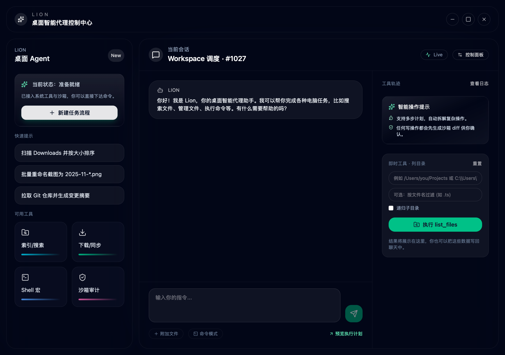

# LionClient 归档碑文

> 一个诞生在桌面 Agent 还没完全长出来时的小玩具。

项目已归档为学习和纪念用途，不再以通用 Agent 产品为目标继续维护。

## 为什么会有这个项目

LionClient 最初想做的是一个运行在本地桌面上的 AI Agent：用户用自然语言说需求，模型负责理解和规划，客户端负责安全地调用本地工具，完成文件搜索、命令执行、环境配置、桌面操作等任务。

那时的想法并不离谱。后来的 OpenClaw、Codex、Hermes，以及各种 MCP / skill 生态，都证明了这条路是成立的。只是这个项目出现得太早了一点：**国产模型还不够会用工具。**

所以它没有成为一个真正能打的产品。它更像是一个提前写下的草稿。

## 它做过什么

- 用 Tauri + React 搭了一个跨平台客户端外壳
- 尝试把 LLM 对话和本地工具调用接起来
- 实现过文件读取、目录扫描、命令执行、网页抓取等本地工具
- 尝试过 ReAct 风格的 Reason -> Act -> Observe 循环
- 加入过工具执行轨迹、结构化确认按钮、流式输出和中断逻辑
- 讨论过 MCP、skills、RAG、本地文档索引、桌面宠物形态等方向

这些能力今天看起来都已经不稀奇了，但它们在当时是一个人摸索 Agent 系统时留下的脚印。

## 为什么归档

因为时代跑得太快了。

短短半年内，通用 Agent 工具开始变得成熟。Codex、openClaw、Hermes 之类的工具，在代码理解、工具调用、任务规划、上下文管理上都远远超过了这个小项目。继续把 LionClient 当成“通用桌面 Agent 产品”来做，意义已经不大。

从提交记录看，它真正密集开发的时间主要集中在 2025 年 11 月和 12 月。是一个在开发过程中逐渐丧失信心的项目：功能一点点接上，工具一点点补齐，但每往前走一步，都会更清楚地意识到底层模型和接入生态还撑不起这个野心。

它不是输在想法上，也不是桌面 Agent 这个方向错了。它输在平台、模型、生态和工程资源还没有同时到位。

## 真正卡住它的地方

当时 Rust 生态没有足够成熟的 LangChain / LangGraph 式 Agent runtime，LLM 流式输出、tool calls、工具结果回填、中断、审批和错误恢复都要自己手搓。Rust 适合做本地能力层和桌面壳，却不适合在早期原型阶段承担整个 Agent 编排层，这点就浪费了大量的精力和时间。

但更准确地说，它最先输在模型上。

回头看，项目早期接入国内模型和 SiliconFlow 这类平台，几乎注定会卡住。当时国内模型在 benchmark 上看起来已经很热闹，但一进真实桌面 Agent 场景就容易露馅：工具参数不稳，上下文不记账，执行后不会根据 observation 继续调整，路径和命令经常差一点，出错后也很难自己把任务拉回正轨。它们像是在回复你，但并没有真的接管任务现场。

真正适合 LionClient 的，其实应该是当时海外第一梯队的执行型模型：Claude、Gemini、GPT 这类更擅长工具调用、代码理解和长任务执行的模型。不是说接上它们就一定能做成商业产品，但至少 demo 会更像“真的有东西在干活”，而不是“界面和工具都准备好了，模型在里面摸鱼”。

所以这才是最主要的教训：Agent 项目的核心能力，首先不是 UI，不是框架，也不是工具列表，而是底层模型能不能真的接管任务现场。如果模型只停留在“像是在回答”，而不是“真的在执行”，上层工程做得再热闹，也只是给一个不够可靠的大脑装修房子。

## 海内外的参差

还有一个现实问题：那时不是没有更强的模型，而是这个项目没有方便、稳定、低成本地用上它们。

当时国内还没有后来这么繁荣的中转站生态，也很难像后来通过 OpenRouter、各种 API 聚合和代理渠道那样，低摩擦地接入海外模型。对于一个个人项目来说，模型接入、网络稳定性、支付、额度、延迟和 API 兼容性，都会直接影响它能不能持续试错。

很多 Agent 项目看起来是在拼 UI 和工具，实际上是在拼底层模型、工具协议、上下文工程、安全策略和长期维护。输几个命令谁不会，真正难的是让模型稳定理解当前状态、可靠选择工具、读懂工具结果，并在多轮任务里不走丢。

## 闭门造车与信息时差

还有一个问题：它基本是在本地闭门造车。

很多 AI Agent 的关键范式，比如 tool calling、MCP、skills、ReAct、上下文工程、长期记忆、Agent workspace，最早是在更靠近模型厂、开源社区和英文技术讨论的环境里快速长出来的。那里的人能更早看到一手 repo、Discord 讨论、SDK 更新和实验项目，也更容易把半成品先开源出来，接受社区反馈。

等这些东西经过几层搬运、翻译、总结、课程和二次包装之后，再传到手里，往往已经不是第一口热饭。不是没有知识，而是信息链路太长，很多时候接触到的已经是别人消化过几轮的版本。

LionClient 没有早点开源，也没有被真实社区反馈锤过。它留在本地文件夹里，慢慢变成了一个过期的半成品。也许开源了也不会怎样，也许没人用，也许只会多几个 issue；但至少它会成为一个公开坐标，证明在那个时间点，有人试图把本地桌面、工具调用和 AI Agent 接在一起。

## 半年里的变化

这半年里变化最快的，甚至不只是小项目被追上。连 Cursor 这样一度代表 AI 编程入口的产品，也很快从“领先者”变成被 Codex、Claude Code、开源 Agent 和模型厂工具反复追赶、拆解、重估的对象。AI 工具的护城河比想象中薄得多：今天看起来像产品壁垒的东西，明天可能只是模型厂的一次更新、一个协议标准、一个官方工具调用能力。

生态位大的，自己很难做过模型厂和成熟 Agent；生态位小的，又随时可能被平台或模型厂顺手取代。如果核心能力来自别人的底层模型，那么很多功能只是“还没被巨头放进主线产品”而已，不是真的安全。

最可气的是，连桌宠这种原本看起来很边角、很个人化的体验，也被 Codex 和 Claude Code 这样的项目顺手吃掉了。

## 一个值得记下的时间点

按 Git 记录看，OpenClaw 的首次提交是 2025 年 11 月 24 日 18:16:47（北京时间），LionClient 的首次提交是 2025 年 11 月 26 日 21:54:13。

也就是说，这个项目只比 OpenClaw 仓库的创建和首次提交晚了两天多一点。

但这并不等于它晚于 OpenClaw 后来的 Agent 形态。OpenClaw 直到 12 月中旬才出现 Agent 相关提交。如果按 Agent 雏形来算，LionClient 比 OpenClaw 早的多。

它不是在很久以后复刻一个已经成熟的方向，而是在同一波“本地 / 端侧 Agent”浪潮刚冒头的时候，几乎同时写下的一个粗糙尝试。后来几天，豆包 AI 手机也开始进入视野。那段时间，桌面、本地、端侧、Agent 这些词突然一起热了起来。

这也许是它最值得纪念的地方：它没有跑赢时代，但它确实踩在了那一波浪潮刚起的时候。

## 它还剩什么价值

它适合作为一个学习项目保留下来：

- 学 React / Tauri / Rust 桌面客户端架构
- 学 tool calling 怎么从 UI 传到后端，再把结果返回给模型
- 学 ReAct loop 如何把工具观察重新塞回对话
- 学技术栈选择如何影响 Agent 原型的试错速度
- 学一个早期 Agent 项目如何被后来的生态快速追上
- 学一个闭门造车的项目为什么需要更早地暴露给社区

它没有达到一个可用产品最基本的要求：稳定说话、稳定响应、稳定完成小任务。把它归档，因为它足够诚实地记录了一个未完成的探索。

## 给后来的自己

这个项目可以删，但也可以留着。

留着不是因为它多有用，而是因为它记录了一段时间：桌面 Agent、tool calling、MCP、skills、RAG、上下文工程这些东西还没变成标配时，一个小项目试图把它们摸出来。

它是玩具，也是纪念碑。

江湖路远，就归档于此。
